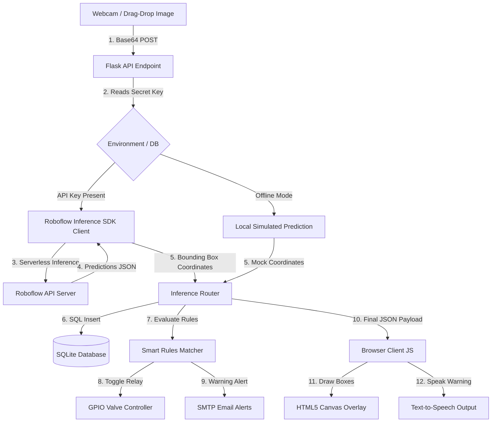

# Crop Disease Detection & Smart Irrigation Hub

An intelligent, autonomous agronomy system that analyzes crop leaves for infections and manages farm water valves dynamically using customizable rules. Designed for deployment on local edge controllers (e.g., Raspberry Pi 5) and desktop environments.

Developed with ❤️ and dedicated to premium visual layout aesthetics.

---

## 🏗️ System Architecture

This project implements a **Secure Backend-Proxy Inference** model. To safeguard developer credentials, the private Roboflow API Key is kept entirely in the backend `.env` variables and is never exposed to the client-side JavaScript.

### Data Flow Pipeline


---

## 🌟 Key Features

1. **🔒 Secure Backend Inference**: All model invocations proxy through the local Python environment. The Roboflow API keys are masked inside administrative pages.
2. **🤖 Smart Rules Engine**: Custom rules engine allowing admins to match specific crop species and disease states against confidence thresholds to execute actions:
   * **Start Irrigation**: Cycles valves for $X$ seconds.
   * **Stop Irrigation**: Turn off valves (essential to prevent fungal spores from multiplying on wet foliage).
   * **Notify Only**: Dispatch asynchronous SMTP email alerts to the agronomist.
   * **Do Nothing**: Log metrics for passive observation.
3. **🌦️ Weather Microclimate risk advisor**: Directly queries the free Open-Meteo weather API using the client's browser geolocated coordinates to calculate crop humidity-risk warnings.
4. **📊 Analytics Dashboards**: Built-in Apache ECharts displaying timeline distributions, disease severity percentages (🟢 Normal, 🟡 Moderate, 🔴 Severe), and irrigation log histories.
5. **📁 Batch Image Processor**: Drag-and-drop file interface featuring sequential uploads, asynchronous queue logs, progress trackers, and aggregated summary reports.
6. **📜 Pagination Timeline**: Interactive diagnosis history panel supporting search filters, original-vs-detected compare slider handles, PDF diagnostic report exporters, and CSV raw data downloads.

---

## 🧪 Researched Pesticide Dosage Rates

The hub incorporates precise chemical treatment advisory thresholds to assist farmers in remediation:

| Crop Class | Diagnosed Disease | Recommended Pesticide | Precise Dosage Rate | Frequency |
| :--- | :--- | :--- | :--- | :--- |
| **Tomato / Potato** | Late Blight | Mancozeb (Dithane M-45) | `2.0 - 2.5 grams / Liter` | Every 5-7 days in wet weather |
| **Tomato / Potato** | Early Blight | Chlorothalonil (Daconil) | `1.5 - 2.0 mL / Liter` | Every 7-10 days at first spot |
| **Corn** | Common Rust | Pyraclostrobin (Headline) | `0.8 - 1.2 mL / Liter` | Apply at pustule; repeat in 14d |
| **Apple** | Apple Rust | Myclobutanil (Immunox) | `1.25 mL / Liter` | Petal fall, weekly for 3 weeks |
| **Apple** | Apple Scab | Captan 80 WDG / Sulfur | `2.5 grams / Liter` | Green tip, weekly for 2 cycles |
| **All Crops** | Generic Rust | Copper Octanoate Soap | `1.5 grams / Liter` | Spray foliage every 7-10 days |
| **All Crops** | Generic Scab | Lime-Sulfur spray | `2.0 mL / Liter` | Apply weekly during damp spring |

---

## 🛠️ Local Setup and Run

### 1. Requirements
* Python 3.9+ (Fully compatible up to Python 3.14)
* SQLite3

### 2. Installation
Clone the project repository, initialize a Python virtual environment, and install dependencies:
```bash
# Create and activate virtual environment
python3 -m venv .venv
source .venv/bin/activate

# Install dependencies (incorporates inference-sdk and visual requirements)
pip install -r requirements.txt
```

### 3. Environment Configuration
Create a `.env` file in the root folder to securely configure environment variables:
```env
ROBOFLOW_API_KEY=your_private_api_key
```

### 4. Running the App
Start the Flask web app server:
```bash
python3 app.py
```
Open **`http://localhost:5001/`** in your browser.

* **Admin Role**: Username `admin` / Password `admin`
* **Farmer Role**: Username `farmer` / Password `farmer`

---

## ⚙️ Hardware Controls (Raspberry Pi 5)
When run on a Raspberry Pi 5, the app attempts to interact with **GPIO Pin 18** using `gpiozero` to control the physical irrigation relay. On non-Pi environments (such as Mac, Linux, or Windows PCs), it gracefully fails over to a **Mock GPIO Driver**, printing valve state updates to the terminal console so that full product presentations run flawlessly.

---
## The Final Output


---


*Made By Kuldeep Sisodiya❤️*
